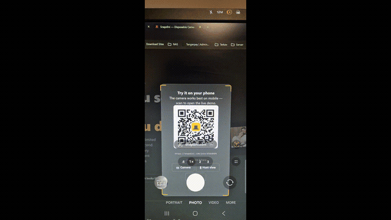
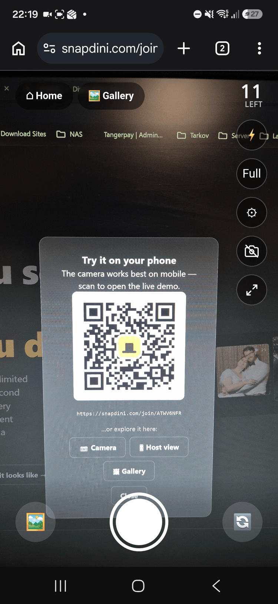
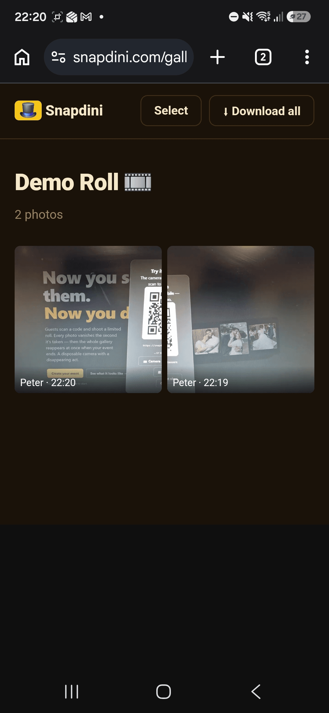
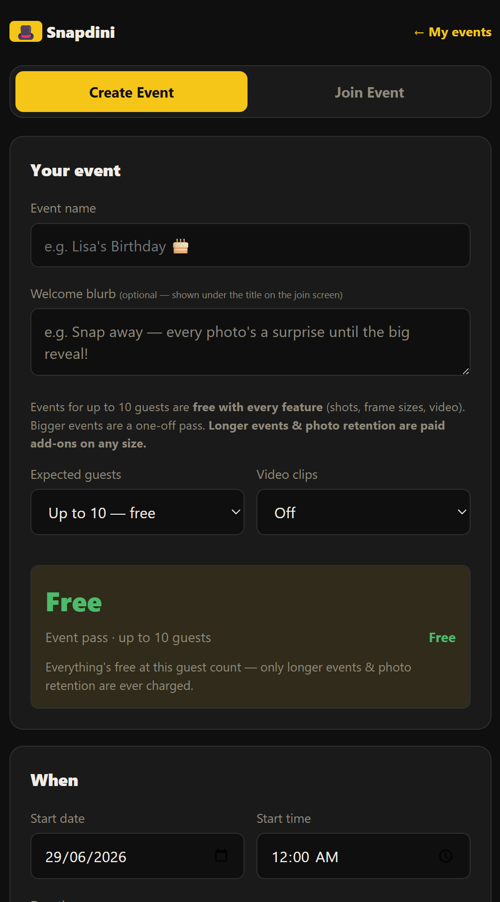

# Snapdini

A digital **disposable camera for events** — guests scan a QR (no app to install), snap a
limited roll, and the whole gallery reappears when the event ends. Self-hostable and free;
optional Stripe billing switches on only when keys are set.

- **Backend** — `app/` — Express + TypeScript (run via `tsx`) + Postgres + Drizzle ORM.
- **Frontend** — `web/` — SvelteKit 2 + TypeScript (adapter-node), served behind nginx.
- Per-stack Docker Compose; Traefik (managed separately) routes the public domains → host ports.

📖 **New here?** [`docs/GUIDE.md`](docs/GUIDE.md) walks through every page and what each control does
(visitor → organizer → guest → site admin). 🧪 [`TESTING.md`](TESTING.md) is the manual QA checklist.

## See it in action

<p align="center">
  
</p>

<table>
  <tr>
    <td width="50%"></td>
    <td width="50%"></td>
  </tr>
  <tr>
    <td align="center"><b>Guests scan &amp; shoot</b><br><sub>A limited roll, right in the browser</sub></td>
    <td align="center"><b>One shared gallery</b><br><sub>Reveal at the end, download the lot</sub></td>
  </tr>
  <tr>
    <td width="50%"></td>
    <td width="50%"></td>
  </tr>
  <tr>
    <td align="center"><b>Set up in a minute</b><br><sub>Name it, pick the roll size &amp; reveal</sub></td>
    <td align="center"><b>Print the QR poster</b><br><sub>Drop it on the tables — guests join in a tap</sub></td>
  </tr>
</table>

## Quick start — run the published image

The fastest way to self-host. No build needed; pulls prebuilt images (app + SvelteKit web) and runs
them with Postgres + nginx.

```bash
# 1. Grab the compose file + nginx config + env template
mkdir snapdini && cd snapdini
curl -O https://raw.githubusercontent.com/paytah232/snapdini/main/app/docker-compose.yml
mkdir nginx && curl -o nginx/default.conf https://raw.githubusercontent.com/paytah232/snapdini/main/app/nginx/default.conf
curl -o .env https://raw.githubusercontent.com/paytah232/snapdini/main/app/.env.example   # then edit it

# 2. At minimum set BASE_URL (your public https URL) + POSTGRES_PASSWORD in .env.
#    Optional: STRIPE_* (billing), MAILGUN_* (email), ADMIN_EMAIL/PASSWORD (admin panel).

# 3. Pull + run (serves on HTTP_PORT, default 8080 — put your own TLS / reverse-proxy in front)
docker compose pull
docker compose up -d
```

- Images: `ghcr.io/paytah232/snapdini-app` and `ghcr.io/paytah232/snapdini-web`. Pin a version with
  `IMAGE_TAG=1.0.0` in `.env` (default `latest`); use your own registry via `IMAGE_PREFIX`.
- **Upgrades** are just `pull` + `up -d` — the app applies any new DB migrations automatically on boot.
- Billing / email / admin are **off until you set their keys** — it runs fully free out of the box.

> These pull the official `paytah232` images. To publish/run your own, set `IMAGE_PREFIX` in `.env`
> (see **Releasing** below).

## Build it yourself (from source)

```bash
git clone https://github.com/paytah232/snapdini.git && cd snapdini/app
cp .env.example .env            # edit: BASE_URL, POSTGRES_PASSWORD, optional Stripe/Mailgun/admin
docker compose -f docker-compose.dev.yml up -d --build     # dev stack (hot-reload)
```
The dev stack bind-mounts the source for hot-reload. For production you don't build at all — run the
**published images** with `docker-compose.yml` (see **Quick start** above). To publish your own images
from a fork, see **Releasing** below.

## Two ways to run

| Mode | File | What it does |
|---|---|---|
| **Published images** (default) | `app/docker-compose.yml` | Pulls `ghcr.io/paytah232/snapdini-{app,web}` + Postgres + nginx. For self-hosting / production. |
| **Build from source** | `app/docker-compose.dev.yml` | Builds app + web from local source with hot-reload, for development. |

Each compose file declares an explicit **`name:`** (project) so stacks stay isolated on one host —
keep it; otherwise a `down` on one can tear down another. Run prod from its own folder with its own
`.env` (don't share the dev tree's env).

### Dev stack tips
```bash
cd app
docker compose -f docker-compose.dev.yml up -d             # start (builds on first run)
docker compose -f docker-compose.dev.yml up -d --build web  # after web changes
docker compose -f docker-compose.dev.yml restart app        # after backend changes (src is bind-mounted)
docker compose -f docker-compose.dev.yml restart nginx      # after recreating app (stale upstream → 502)
```

## Landing hero images (the film-strip)

The rotated film-strip on the landing page (`web/src/routes/+page.svelte`) shows four frames.
By default they're warm gradients; drop real photos in to replace them:

- Put `1.jpg … 4.jpg` in **`web/static/sample/`**, then rebuild web. Missing files fall back
  to the gradient automatically.
- **Any aspect ratio is fine** — each frame adopts its image's real shape on load, so a mix of
  1:1 / 4:5 / etc. displays true-to-shape (equal width, centre-aligned).
- The resize uses a Svelte action that checks `img.complete` **and** listens for `load`. This is
  deliberate: relying on the `load` event alone misses **already-cached** images (the image
  finishes before the handler attaches), which made the resize hit-or-miss. Keep both paths.

## Other dev notes / gotchas

- **Typecheck runs on the HOST, not in the container** — `tsconfig.json` isn't bind-mounted, so
  `tsc` inside the app container can't find it. Use `npm run typecheck` from `app/` (or the root).
- **`BASE_URL` is REQUIRED in production** — it's baked into QR codes, email/verify links, Stripe
  redirects + webhook, and OG tags. For security the app does **not** trust the request `Host`
  header for these in prod (anti host-header-poisoning); if `BASE_URL` is unset it logs a warning
  and falls back to the host. Always set it (dev default: `http://localhost:3001`).
- **Billing is env-gated** — `STRIPE_SECRET_KEY` unset ⇒ billing off, no "Pro" UI, fully free
  (the self-host default). Keys live in `app/.env` (dev) / `app/.env.release` (prod), gitignored.
- **Site admin** is bootstrapped from `ADMIN_EMAIL`/`ADMIN_PASSWORD` (no shipped default).
- **Contact form** (`/contact`) is a **durable DB mailbox**: every submission is stored in the
  `contact_messages` table and surfaced under **Site admin → Contact messages** (with a *mark
  done* toggle). If **`SUPPORT_EMAIL`** + an email transport (Mailgun/SMTP) are configured it
  *also* forwards the message by email (best-effort) — but submitting always succeeds and is
  never lost if email is off or fails. On a Mailgun **sandbox** domain, `SUPPORT_EMAIL` must be
  an *authorized recipient* or the forwarded copy won't deliver (the DB record is kept regardless).
- **Google sign-in (optional)** — set `GOOGLE_CLIENT_ID` + `GOOGLE_CLIENT_SECRET` to show the
  Google button. Create them at <https://console.cloud.google.com/apis/credentials> (OAuth client
  ID → "Web application"); the **Authorised redirect URI must be `<BASE_URL>/api/auth/google/callback`**
  and match `BASE_URL` exactly. CSRF `state` is handled automatically. Both unset ⇒ button hidden.
- **Social share image** — `web/static/og.png` is generated by `app/src/scripts/make-og.mjs`
  (needs the fonts baked into `Dockerfile.dev`). See that script's header to regenerate.
- **Capacity / load testing** — uploads are the CPU-bound ceiling; see `loadtest/CAPACITY.md`
  and `npm run test:load` / `npm run test:load:multi`.

## Releasing (maintainers)

Two images are published per release — `snapdini-app` (Express API) and `snapdini-web` (SvelteKit).

**Automated (recommended):** push a version tag and GitHub Actions builds + pushes both, multi-arch
(amd64 + arm64), to GHCR — no registry secrets needed (uses the built-in `GITHUB_TOKEN`):
```bash
# bump app/package.json + web/package.json to the new version first, commit, then:
git tag v1.0.0 && git push origin v1.0.0
```
Workflow: `.github/workflows/release.yml`. Output: `ghcr.io/<owner>/snapdini-app:1.0.0` (+ `:latest`)
and `…-web:…`. Make the GHCR packages public so self-hosters can pull without auth.

**Manual (no CI):** `app/publish.sh <version> <prefix>` does the same with `docker buildx` after a
`docker login`:
```bash
cd app && ./publish.sh 1.0.0 ghcr.io/youruser/snapdini
```

Self-hosters consume these via the **Quick start** above — `docker-compose.yml` pulls them. Pin a
release with `IMAGE_TAG` in `.env` (e.g. `1.0.0`); point at your own registry with `IMAGE_PREFIX`.

## Support

Snapdini is free and self-hostable. If it's useful to you and you'd like to support the work, you can
**[buy me a coffee ☕](https://buymeacoffee.com/paytah232)** — much appreciated, never required.

## License

Released under the [GNU AGPL-3.0](LICENSE). You're free to self-host, modify and redistribute it; if
you run a modified version as a network service, you must make your source available under the same
licence. © 2026 paytah232.
