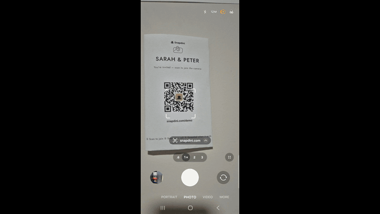
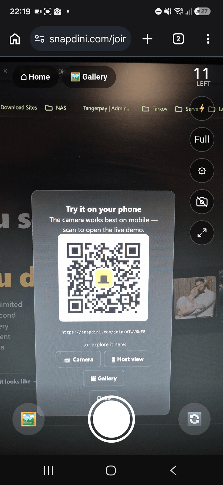
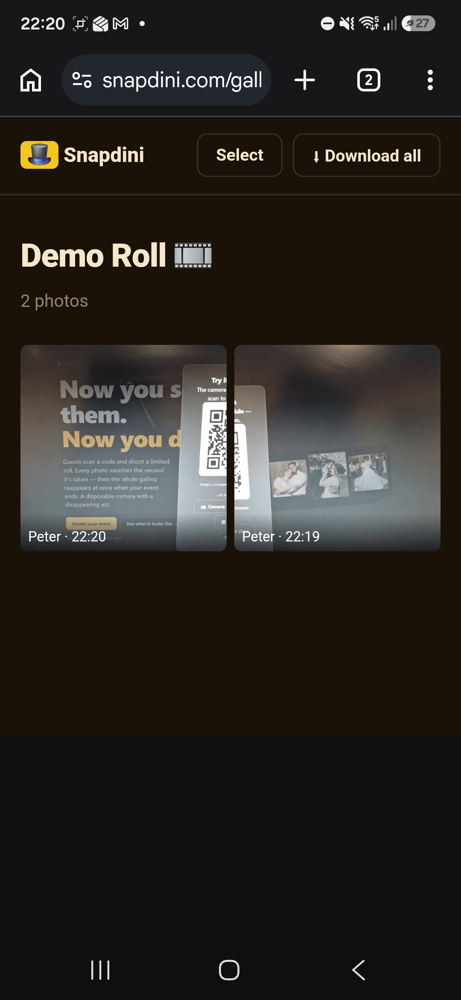
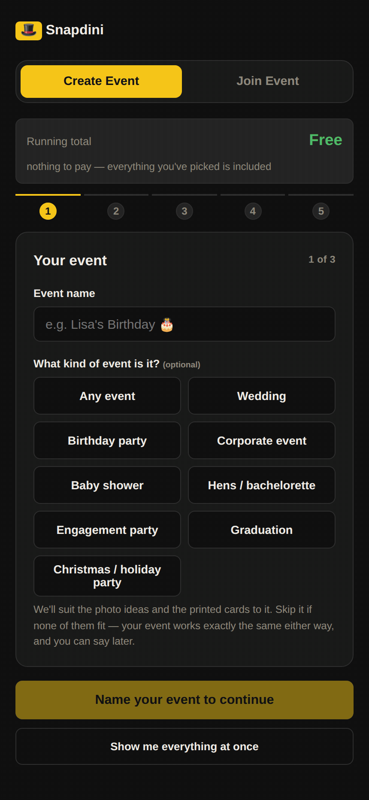

# Snapdini

📸 A digital **disposable camera for events**. Guests scan a QR code — no app to install — snap a
limited roll, and the whole gallery reappears when the event ends. **Free for small events,
open-source, and self-hostable.**

🔗 Hosted version: **[snapdini.com](https://snapdini.com)**  ·  📖 How to use it: **[docs/GUIDE.md](docs/GUIDE.md)**

## See it in action

<p align="center">
  
</p>

<table>
  <tr>
    <td width="50%"></td>
    <td width="50%"></td>
  </tr>
  <tr>
    <td align="center"><b>Guests scan &amp; shoot</b><br><sub>A limited roll, right in the browser</sub></td>
    <td align="center"><b>One shared gallery</b><br><sub>Reveal at the end, download the lot</sub></td>
  </tr>
  <tr>
    <td width="50%"></td>
    <td width="50%"></td>
  </tr>
  <tr>
    <td align="center"><b>Set up in a minute</b><br><sub>Name it, pick the roll size &amp; reveal</sub></td>
    <td align="center"><b>Print the QR poster</b><br><sub>Drop it on the tables — guests join in a tap</sub></td>
  </tr>
</table>

## Quick start — self-host it

No build step. Pulls the prebuilt images and runs them with Postgres + nginx.

```bash
mkdir snapdini && cd snapdini
curl -O https://raw.githubusercontent.com/paytah232/snapdini/main/app/docker-compose.yml
mkdir nginx && curl -o nginx/default.conf https://raw.githubusercontent.com/paytah232/snapdini/main/app/nginx/default.conf
curl -o .env https://raw.githubusercontent.com/paytah232/snapdini/main/app/.env.example
# the upgrade helper — it checks the traps that `pull && up -d` alone will not
curl -o upgrade.sh https://raw.githubusercontent.com/paytah232/snapdini/main/app/scripts/upgrade.sh && chmod +x upgrade.sh

# edit .env — at minimum set BASE_URL (your public https URL) + POSTGRES_PASSWORD
docker compose pull
docker compose up -d
```

Snapdini is now on `HTTP_PORT` (default `8080`) — put your own TLS / reverse proxy in front.

- **Fully free, no limits, when self-hosted.** Billing, email, the admin panel and analytics stay
  **off until you add their keys** (`STRIPE_*`, `MAILGUN_*`, `ADMIN_*`, `GTAG_ID`/`MSUET_ID` in
  `.env` — all optional; no tag id ⇒ zero third-party tracking). `.env.example` documents every
  setting.
- **Upgrades**: run `./upgrade.sh [version]`, or see **[UPGRADING.md](UPGRADING.md)**.
  DB migrations apply on boot, but `pull && up -d` alone is not always enough — a release can add
  settings that must go in **both** `.env` and `docker-compose.yml` (compose passes env explicitly,
  so a variable missing from it is silently ignored), and it never updates your `docker-compose.yml`
  or `nginx/default.conf`.
### Optional: "find the photos I'm in" (self-host only)

Guests can upload a selfie and pull out just the photos they appear in. It is **off in the hosted
service and shipped off by default**, because face templates are biometric data and the compliance
picture varies by jurisdiction — but if you run your own instance for your own events, it is a
genuinely good feature and it is fully built.

Point `MACHINE_LEARNING_URL` at an [Immich machine-learning](https://github.com/immich-app/immich)
container. It talks over plain HTTP with image bytes in the request, so **the ML container needs no
access to your photo storage** — no shared volume, no bind mount. It can live on the same box or a
different one.

```yaml
  machine-learning:                       # add to your docker-compose.yml
    image: ghcr.io/immich-app/immich-machine-learning:release
    volumes: [ model-cache:/cache ]       # models only — never your photos
    restart: unless-stopped
```
```bash
MACHINE_LEARNING_URL=http://machine-learning:3003
```

With it unset the feature does not exist: no host toggle, no guest control, no privacy-policy
section, and the endpoints return 503. With it set, it is still **off per event** until a host turns
it on, and then **off per guest** until that guest ticks an unticked consent box. A guest's selfie is
deleted in the same request that creates their template; every other face in a photo is compared and
discarded in memory. "Stop and delete" removes the template and every match it produced, and keeps
working even if you later switch the ML container off.

**Think carefully before turning this on for anyone other than yourself.** Face templates are
biometric data in most jurisdictions. Two things in particular need an answer you are comfortable
with: you necessarily process the faces of guests who never consented in order to find the one who
did, and events often include minors. Take your own advice on it — this project cannot give you
legal advice for your country.

- **Pin a version** with `IMAGE_TAG` in `.env` (e.g. `IMAGE_TAG=1.0.2`; default `latest`). Point at
  your own registry with `IMAGE_PREFIX`.

## Built with

Express + TypeScript + Postgres (Drizzle ORM) for the API, SvelteKit for the web app, behind nginx —
all in Docker. Building from source, developing, or publishing your own images? See the
**[development & maintainer guide](docs/DEVELOPMENT.md)**.

## Support

Snapdini is free and self-hostable. If it's useful to you and you'd like to support the work, you can
**[buy me a coffee ☕](https://buymeacoffee.com/paytah232)** — much appreciated, never required.

## License

Released under the [GNU AGPL-3.0](LICENSE). You're free to self-host, modify and redistribute it; if
you run a modified version as a network service, you must make your source available under the same
licence. © 2026 paytah232.
